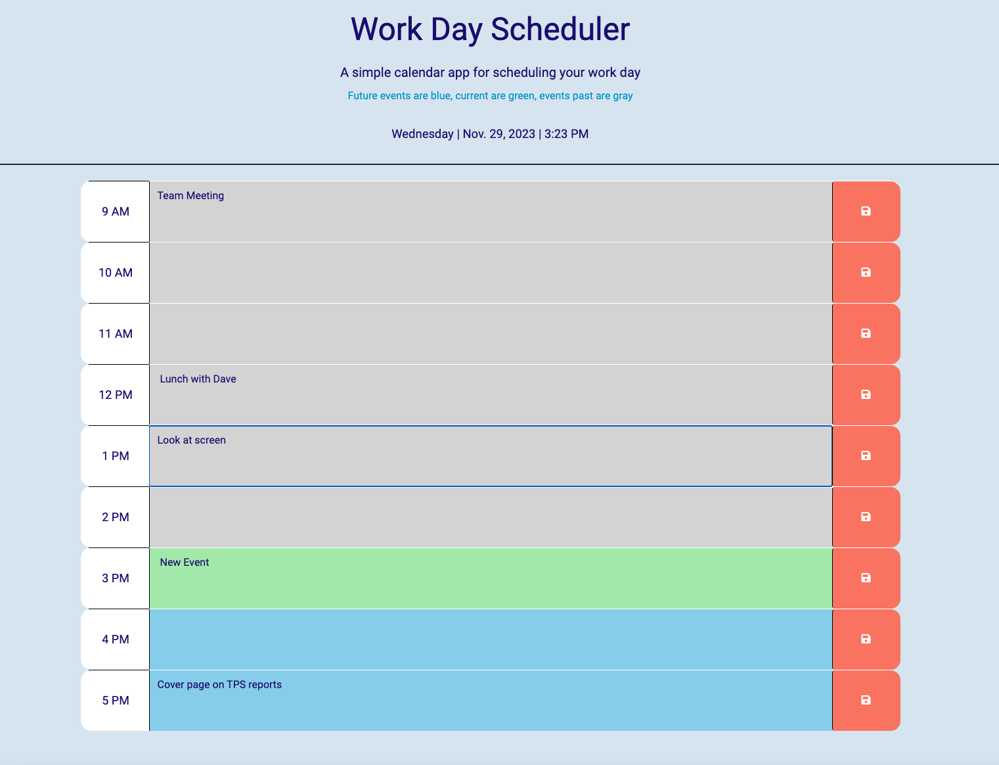

# work-day-calendar

* A web browser calendar app using HTML, CSS, jQuery &amp; day.js

## User Story

```md
AS AN employee with a busy schedule
I WANT to add important events to a daily planner
SO THAT I can manage my time effectively
```

## Acceptance Criteria

```md
GIVEN I am using a daily planner to create a schedule
WHEN I open the planner
THEN the current day is displayed at the top of the calendar
WHEN I scroll down
THEN I am presented with timeblocks for standard business hours of 9am - 5pm
WHEN I view the timeblocks for that day
THEN each timeblock is color coded to indicate whether it is in the past, present, or future
WHEN I click into a timeblock
THEN I can enter an event
WHEN I click the save button for that timeblock
THEN the text for that event is saved in local storage
WHEN I refresh the page
THEN the saved events persist
```

## Mock up

Here is an image showing the appearance of the application:



* Here is a link the the live application: [click here](www.cookingmeister.github.io/work-day-calendar)

## Credits

Starter code template was provided by Edx. MDN Web Docs, W3Schools and freeCodeCamp have been invaluable resources for this project.

## License

Please see the attached license file.
